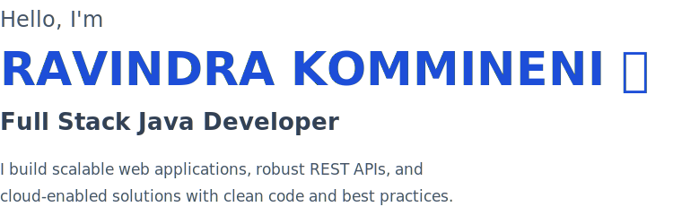
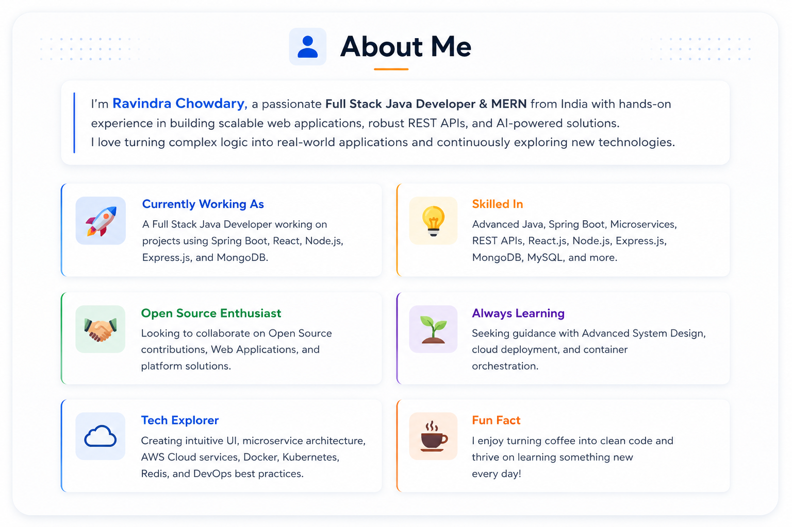
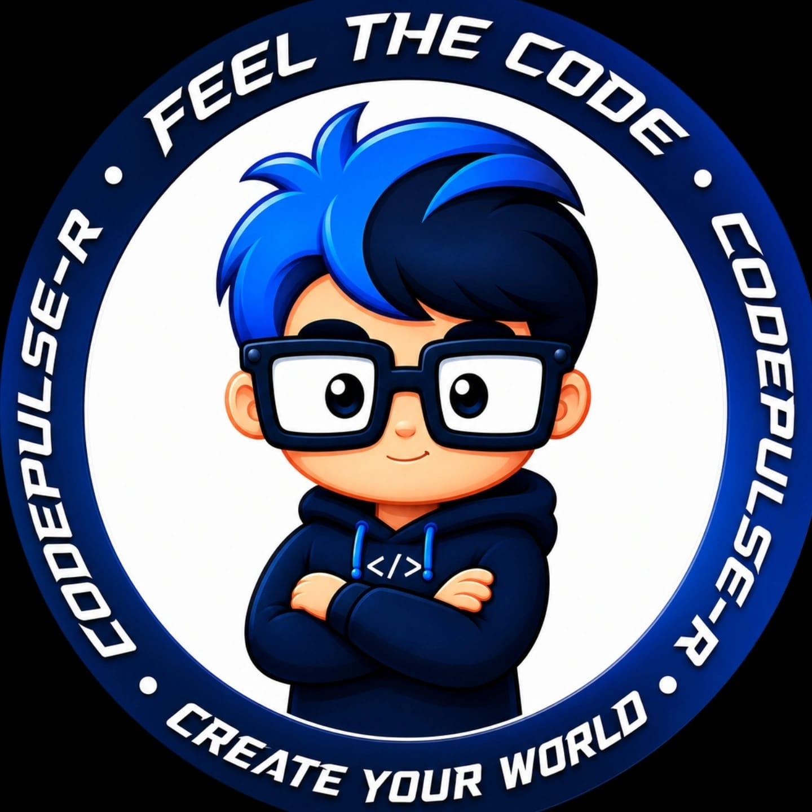
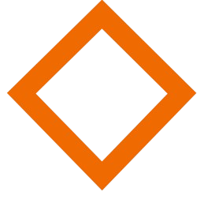
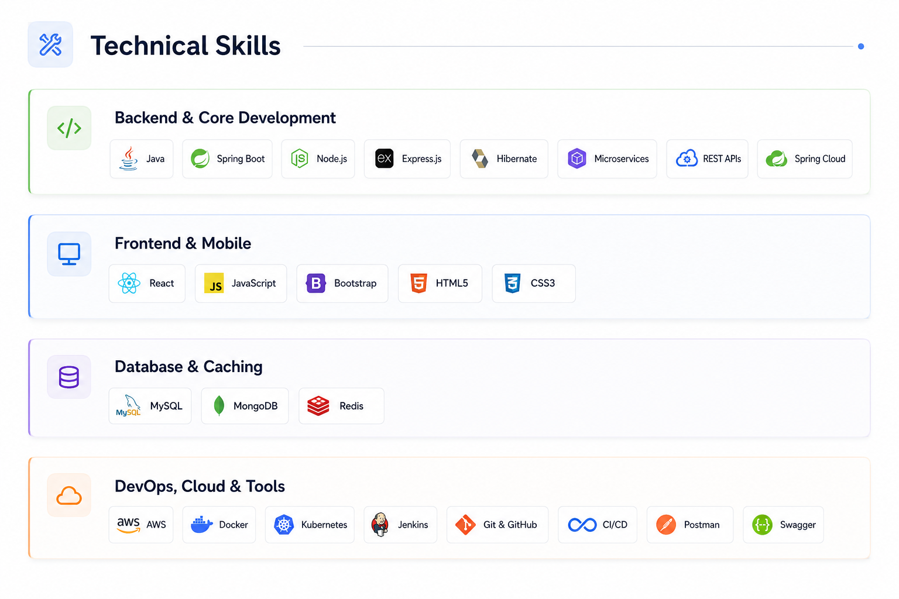

<table border="0" cellspacing="0" cellpadding="0" width="100%">
<tr>
<td width="55%" valign="middle" align="left">

 

 

&nbsp;&nbsp;&nbsp;&nbsp;&nbsp;

  

</td>
<td width="45%" valign="middle" align="center">

</td>
</tr>
</table>

---

&nbsp;
&nbsp;
&nbsp;
&nbsp;

---

 

---

## 💼 Projects

<table width="100%" border="0" cellspacing="8" cellpadding="0">
<tr>
<td width="50%" valign="top">

### &nbsp; CodePulse-R &nbsp; 

A professional web development service platform and technical workshop management ecosystem built to deliver high-performance training solutions.

</td>
<td width="50%" valign="top">

### &nbsp; MyGoMinds &nbsp; 

An interactive, user-centric application designed to bridge technical learning, training resources, and smart logic workflows seamlessly.

</td>
</tr>
<tr>
<td width="50%" valign="top">

### &nbsp; Sathya Technologys &nbsp; 

A platform for technical courses, student training portals, and institutional learning solutions.

</td>
<td width="50%" valign="top">

### &nbsp;🍽️ Tasty Bites &nbsp; 

A modern food ordering web application built with React.js, featuring a rich UI, dynamic menu browsing, and seamless ordering experience.

</td>
</tr>
</table>

---

 

---

## 📊 GitHub Analytics

&nbsp;

  

  

---

## 📫 Get In Touch

Whether you have a question or just want to say hi, I'll try my best to get back to you!

 

*© 2024 Ravindra Chowdary. All rights reserved. &nbsp;|&nbsp; Built with ❤ and lots of ☕*

